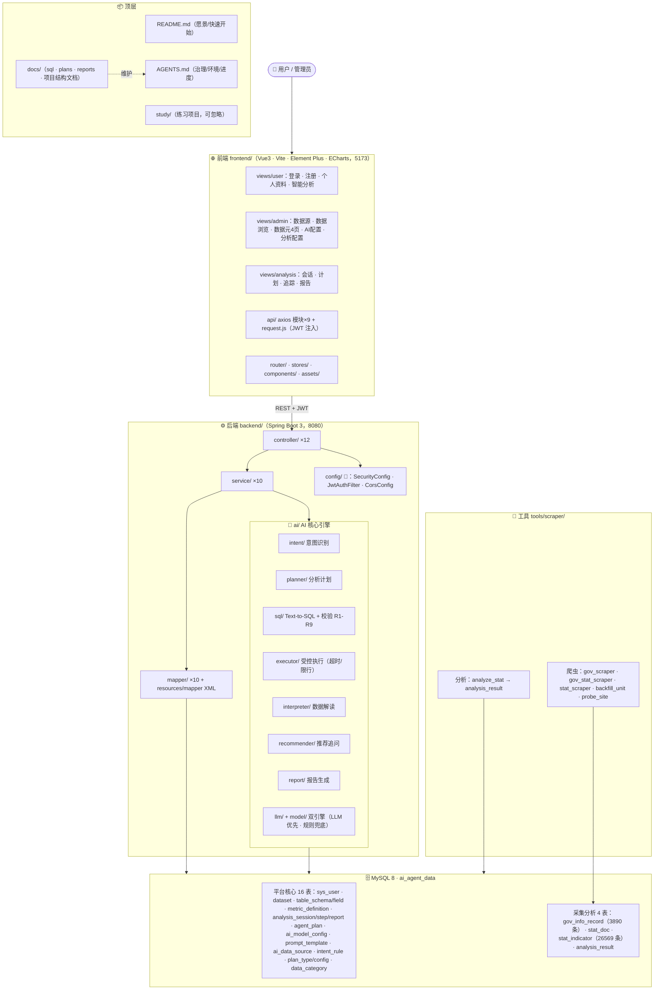

# AI Agent 数据分析平台 · 项目结构文档

> **文档定位**：工程结构地图——给「自己 + GitHub 开源读者」看的项目导览：后端包结构、前端目录、数据表、接口清单、工具与测试。
> **最后核对**：2026-08-14（对照代码逐项核对）；2026-08-17 补充 mermaid 项目结构图；2026-08-18 同步 Agent 计划流水线（agent_plan 表、/api/agent-plan 拆解/执行/报告接口、计划/追踪/报告三页改造）
> **维护规则**：功能/结构变更（新增接口、数据表、目录、路由）必须同步本文档（见 `AGENTS.md` §2.5）；与实现不符时以代码与 `AGENTS.md` 进度表为准。
> **关联文档**：`README.md`（产品愿景/快速开始）· `AGENTS.md`（环境速查/进度/风险区域/治理协议）· `docs/sql/schema.sql`（平台表 DDL 真源）· `docs/plans/`（阶段实施记录）

---

## 一、总体架构



**核心链路**：`分析目标 → 意图识别(INTENT) → 分析计划(PLAN) → Text-to-SQL(SQL) → 安全校验(VALIDATE) → 受控执行(EXECUTE) → 图表推荐(CHART) → 数据解读(INTERPRET) → 报告生成(REPORT)`，每步按轮次（`round_no`）落库 `analysis_step` 可回溯；同一会话内不同问题追加为新轮，相同问题覆盖该轮（步骤+报告），后续轮次注入会话历史上下文。

**双引擎策略**：意图识别 / SQL 生成 / 纠错 / 解读 / 报告均「LLM 优先、规则兜底」——设置环境变量 `AI_API_KEY`（DeepSeek）即启用 LLM；无 key、超时、异常、空白输出时自动回退规则模板，接口永不失联。

---

## 二、仓库顶层目录

| 目录/文件 | 说明 |
|---|---|
| `backend/` | Spring Boot 3 后端（Java 21，端口 8080） |
| `frontend/` | Vue 3 前端（Vite，端口 5173） |
| `docs/` | 文档：`sql/`（DDL 脚本）、`plans/`（阶段实施记录）、`reports/`（分析产物）、`handover/`（工具迁移交接） |
| `tools/scraper/` | 数据采集管道（政务爬虫/统计指标解析/分析入库） |
| `study/d3-db/` | 个人学习练习项目（与本平台无关，可忽略） |
| `AGENTS.md` | 治理协议 + 环境速查 + 开发进度 + 风险区域 |
| `README.md` | 产品愿景与快速开始 |

---

## 三、后端结构

### 3.1 包结构

```
backend/src/main/java/com/aiagent/
├── AgentApplication.java        # 启动类（组件扫描起点，放最外层）
├── controller/                  # REST 层（12 个，见「五、接口」）
├── service/                     # 业务层（10 个，被 Controller 调用）
├── mapper/                      # MyBatis Mapper 接口（10 个，配 resources/mapper/*.xml）
├── entity/                      # 数据实体（17 个，与平台表一一对应）
├── dto/                         # 请求/响应对象（含统一返回体 ApiResponse）
├── config/                      # 🔴 全局配置：SecurityConfig / JwtAuthFilter / CorsConfig
├── ai/                          # 🔴 AI 核心引擎（见 3.2）
└── util/                        # JwtUtil / TimeRangeParser
```

- **service（10 个）**：`UserService`、`MetadataAdminService`、`DataSourceAdminService`、`DataBrowseService`、`AiConfigService`、`AnalysisConfigService`、`AnalysisHistoryService`、`AnalysisTraceService`（步骤落库与 JSON 安全截断）、`AgentPlanService`（宏观目标拆解 → 逐步执行 → 报告，三页共用）、`StatCategoryService`（统计指标分类树：三级树组装 + 增删改，code 唯一/同级重名/父级层级/删除子节点校验）
- **mapper（10 个）**：`UserMapper`、`MetadataAdminMapper`、`AiDataSourceMapper`、`AnalysisConfigMapper`、`AnalysisSessionMapper`、`AnalysisStepMapper`、`AnalysisReportMapper`、`AiConfigMapper`、`AgentPlanMapper`、`StatCategoryMapper`

### 3.2 AI 引擎 `ai/`（🔴 承重墙）

| 子包/类 | 职责 |
|---|---|
| `intent/` | 意图识别：`LlmIntentRecognizer`（@Primary，LLM 优先+规则兜底）→ `RuleIntentRecognizer`（规则关键词，配置中心驱动，`GENERAL` 兜底，含政务链路标记） |
| `planner/` | 分析计划：`AnalysisPlanner` 按意图生成步骤清单（指标/维度/图表/时间范围），类型路由按「数据集配置 → 业务类型关键词（STAT 含经济） → 政务标记」顺序，STRUCTURE 按地区/产业细化选配置，政务意图走政务模板；`INDICATOR_ALIASES` 已于 2026-08-19 对齐重建后 `stat_monthly` 规范指标名（实际利用境外资金/各项存款/各项贷款/一般公共预算收入/地区生产总值/居民消费价格指数/全市用电总量(亿千瓦小时)），旧名（金融机构本外币存款余额、地方一般公共预算收入、地区生产总值(GDP) 等）归一到规范名不再命中；2026-08-20 阶段3：新增 RANK_METRICS（无区县词的「X排名」提问 → 排名基数指标 + 区县快照 bar）与 CATEGORY_METRICS 大类兜底（外贸/外资→外贸外资族、存贷款→金融运行族、用电/客运/货运→交通运输族、财政→财政收支族、可支配收入→居民收支族），别名修正 中长期消费贷款→消费贷款（库中无此名）；AnalysisPlan 新增 datasetId 字段（null=全库路由），供元数据按数据集裁剪注入 |
| `sql/` | Text-to-SQL：`SqlGenerator` 接口 → `RuleSqlGenerator`（规则模板，政务 RANKING 单位缺失回退类目）+ `LlmSqlGenerator`（元数据注入 Prompt）；`SqlValidator` 9 条安全校验。2026-08-19 治理：stat_monthly 趋势 SQL 增加**同期别过滤**（以指标最新期别为基准，只保留各年同一累计期别，避免 1-3月/1-9月 混画产生「累计增幅 182%」假象）；收入类指标任一命中时自动补齐 全体/城镇/农村 三系列（保证城乡收入比可算）；2026-08-20：LlmSqlGenerator 元数据按 plan.datasetId 裁剪注入（stat 问题不再混政务/订单口径）；stat_monthly 排名/区县快照计划（维度=区县 且 bar）直接走规则引擎确定性 SQL（12 区县最新一期排序），避免 LLM 忽略计划维度生成「全市逐年」错误 SQL |
| `executor/` | 受控执行：`SqlExecutor`，10 秒超时、最多 500 行 |
| `interpreter/` | 数据解读：LLM 优先、规则模板兜底，产出 `interpretation` |
| `recommender/` | 推荐追问：`FollowupRecommender` LLM 优先（RECOMMEND 模板，JSON 数组解析）生成 `followups[]`，未配置/失败回退规则模板 |
| `report/` | 报告生成：三级降级 LLM → 意图业务模板（含政务变体）→ MINIMAL 极简报告 |
| `context/` | 会话上下文：`AnalysisContextBuilder` 取指定轮次前最近 3 轮（问题+解读结论）注入解读/报告 Prompt |
| `metadata/` | 元数据注入：`MetadataService` 组装表结构/字段语义/指标口径进 Prompt（含演示目录 `DemoMetadataCatalog`）。2026-08-19 起对 `stat_*` 统计长表追加【统计口径与期别说明】：period 为累计期别（1-3月/1-6月/1-9月/1-12月）、跨期别不可比、同比须对比上年同期累计、growth_rate 已是同比增速、城乡收入比=城镇÷农村、金额/增速数值格式规范 |
| `llm/` | LLM 客户端：`LlmClient` OpenAI 兼容（DeepSeek），K2 temperature 兼容，错误透传 |
| `model/` | 按任务选模型：`ModelRouter`（SQL 生成/纠错优先 SQL 分析模型，解读/报告等走文本模型） |
| `validate/` | 数据合理性校验：`DataSanityChecker` 在 EXECUTE 后追加 DATA_CHECK 步骤（order 6，WARNING），检测重复键行/时间空值/数值量级异常/结果过大/增速缺失（columns 含 growth_rate 且全空时提示「该指标暂无增速数据，图中展示的为规模绝对值而非增速」），告警仅提示不阻断，返回 `dataWarnings[]` |
| `prompt/` | Prompt 模板加载：`PromptLoader` 按类型加载 `prompt_template` 启用模板并做 `{var}` 占位替换（如 `{datasetSchema}`），异常/未配置回退内置基线 |

**SQL 安全校验 R1-R9**（`SqlValidator`，独立兜底、不依赖生成器）：
R1 空 SQL 拒绝 · R2 含分号拒绝 · R3 剥字符串字面量 · R4 含注释符（--/#/*）拒绝 · R5 非 SELECT 开头拒绝 · R6 语句级黑名单 · R7 危险函数黑名单 · R8 系统库黑名单 · R9 FROM/JOIN 表不在白名单拒绝。

### 3.3 配置与鉴权（`config/`，🔴）

| 类 | 作用 |
|---|---|
| `SecurityConfig` | 鉴权规则 + `PasswordEncoder` Bean |
| `JwtAuthFilter` | JWT 解析过滤器 |
| `CorsConfig` | 跨域配置 |

鉴权规则：
- 公开（permitAll）：`POST /api/auth/login`、`POST /api/auth/register`、`/error`
- 仅管理员（hasRole ADMIN）：`/api/admin/**`
- 其余接口需登录（JWT，未登录统一返回 401 JSON）

---

## 四、数据库（MySQL，库 `ai_agent_data`）

DDL 真源：平台表 = `docs/sql/schema.sql`；统计管道 = `docs/sql/stat-pipeline.sql`；分类 = `docs/sql/data-category.sql`；爬虫表 = `tools/scraper/*.py` 内置 DDL。

### 4.1 平台核心表（16 张）

| 表 | 用途 | 关键字段 |
|---|---|---|
| `sys_user` | 用户 | username(唯一)/password(BCrypt)/role/status |
| `data_category` | 数据元分类 | name(唯一)/color/sort |
| `dataset` | 数据集 | name/table_name/category_id |
| `table_schema` | 数据表元数据 | dataset_id/table_name/table_comment |
| `table_field` | 字段语义 | table_id/field_name/business_meaning/is_metric/semantic_type |
| `metric_definition` | 指标口径 | name/metric_code/calculation_formula/sql_expression/category_id。2026-08-19 补齐 dataset 23（stat_monthly）30+ 条口径：收入三系列/城乡收入比/排名、GDP 与三次产业、工业、投资、贸易、财政、金融、物价、外贸、交通（含累计期别与同比增速说明），脚本 `docs/sql/metric-caliber-2026-08-19.sql`（幂等） |
| `analysis_session` | 分析会话 | user_id/dataset_id/title/analysis_goal/status |
| `analysis_step` | 分析步骤 | session_id/round_no(轮次)/step_order/step_type/input_data/output_data/status/duration_ms |
| `analysis_report` | 分析报告 | session_id/round_no(轮次)/title/content(LONGTEXT)/status |
| `ai_model_config` | AI 模型配置 | model_name/api_key(可入库，列表不回显)/endpoint/temperature/status；LLM 可用判定 = 环境变量 `AI_API_KEY` 或 DB 存在启用且带 Key 的配置 |
| `prompt_template` | Prompt 模板 | type(INTENT/SQL/CHART/INTERPRET/RECOMMEND)/content/variables(逗号分隔占位变量)/sort/status；种子：SQL/INTERPRET/INTENT/RECOMMEND 基线 |
| `ai_data_source` | 数据源（v1 演示） | name/host/port/database_name/username/password |
| `analysis_intent_rule` | 意图规则 | intent_code/keywords(逗号分隔)/priority/status |
| `analysis_plan_type` | 计划类型 | type_code(唯一)/type_name/route_keywords/color/status |
| `analysis_plan_config` | 计划配置 | intent_code/is_gov/plan_type/table_name/metrics/dimensions/chart_type/sql_template |

### 4.2 采集与分析表（4 张）

| 表 | 用途 | 关键字段 |
|---|---|---|
| `gov_info_record` | 政府信息公开记录（爬虫主表，范围：邵阳市） | title/doc_no/publish_unit/category/publish_date/source_url(唯一)/summary |
| `stat_doc` | 统计文档详情（月报/公报/分析正文+附件） | gov_record_id(唯一)/content(LONGTEXT)/attachment_url/parse_status 状态机 |
| `stat_indicator` | 统计指标长表（期间×指标×区县，一行一指标） | period/region/indicator_code/value/unit/growth_rate/source_type/confidence/generator_type。2026-08-19 治理：按业务键 period+region+indicator_name+value+unit 去重（31182→26705），再清 0.01 内取整精度变体（→26569），优先保留专项收入 sheet 与高精度行，备份 `stat_indicator_bak_20260819_s1` |
| `analysis_result` | 结构化分析结果（统计栏目发布分析） | analysis_name/dimension/dim_value/metric_value/metric_unit |
| `stat_monthly` | 统计月报结构化指标（2026-08-19 全量归一重建：raw 36297 行 → 去重 32907 行，期间/区县/指标名统一到 2025 最新表形式；分市州对比表保留、经济板块行保留） | period(统一 YYYY年N-M月，含 9月末→并入 1-9月)/region(规范区县名+市州名)/indicator_name(官方词典归一：地区生产总值/第一二三次产业增加值/进出口（万美元）等)/value/unit(亿元/万元/万美元/元/名)/growth_rate；过滤必须精确匹配 indicator_name 并留意 unit；同一期间同一指标可能存在多行（核算/投资等分表来源），取值应过滤 value IS NOT NULL（三次产业口径=metric_definition.industry_structure_monthly；RuleSqlGenerator 规则 SQL 已做旧名归一（第一产业→第一产业增加值、地区生产总值(GDP)/分县（市、区）GDP→地区生产总值），避免用别名查不到行） |
| `stat_indicator_dict` | 统计月报指标分类字典（2026-08-19 全量映射 339 个 indicator_code，对齐源 Excel 树状结构） | indicator_code/indicator_name/category(一级大类：经济核算/工业经济/固定资产投资/消费市场/外贸外资/财政收支/金融运行/居民收支/交通运输/价格与房地产/综合对比)/sub_category(二级中类)/unit_fixed(标准化单位，已覆写 stat_monthly.unit 9990+302 行脏单位)；DDL 与全量映射见 `docs/sql/stat-indicator-dict.sql`，生成脚本 `tools/scraper/build_stat_category.py` |
| `stat_indicator_category` | 统计指标分类树（2026-08-20 阶段1：10 大类 × 34 中类 × 225 叶子，管理端 el-tree 维护） | parent_id(自引用)/name/code(唯一)/level(1-3)/sort/color(一级)/status；DDL 见 `docs/sql/stat-indicator-category.sql`（幂等重建），由 `build_stat_category.py --tree` 从字典生成 |

### 4.3 数据规模现状（2026-08）

- `gov_info_record`：**3890 条**（政务目录 3601 + 统计三栏目 478），0 重复 / 0 壳页 / 0 导航噪音
- `stat_indicator`：**26,569 条**（2026-08-19 治理去重，31182→26569） / 13 区域 / 117 期间（月报 xlsx 25,236 + 公报 4,858 + 分析 1,088）
- `analysis_result`：73 行（「统计栏目发布分析」，`analyze_stat.py --store` 幂等写入）

---

## 五、接口

### 5.1 约定

- 统一返回体：`ApiResponse {code, message, data}`；请求/响应均为 JSON
- 错误码：400 参数校验失败（`GlobalExceptionHandler`）· 401 未登录 · 403 无权限 · 422 业务错误（如 SQL 校验不过、执行数据不完整）

### 5.2 接口清单（按 Controller 分组）

| 分组（前缀） | 路径 | 方法 | 鉴权 | 作用 |
|---|---|---|---|---|
| Auth `/api/auth` | /login | POST | 公开 | 登录，返回 JWT |
| | /register | POST | 公开 | 注册 |
| | /profile | GET/PUT | 登录 | 查询/更新个人资料 |
| | /password | PUT | 登录 | 修改密码 |
| 分析核心 `/api/analysis` | /parse · /sql · /execute · /report | POST | 登录 | 核心链路，见 5.3 |
| 分析历史 `/api/analysis` | /sessions?keyword&datasetId&page&pageSize | GET | 登录 | 会话列表（关键字/数据集筛选 + 分页，返回 `{rows,total}`） |
| | /session/{id} | DELETE | 登录 | 删除会话 |
| | /session/{id}/steps | GET | 登录 | 会话步骤明细（按轮次分组） |
| | /session/{id}/report?roundNo | GET | 登录 | 某会话某轮次报告内容（roundNo 为空取最新一轮，供会话详情查看报告，避免全量拉取） |
| | /sessions/batch-delete | POST | 登录 | 批量删除会话 `{ids:[]}` |
| | /datasets | GET | 登录 | 数据集选项（不含连接信息） |
| | /models | GET | 登录 | 启用中的模型选项（AI 分析页模型选择器） |
| | /reports?page&pageSize | GET | 登录 | 报告列表（分页，返回 `{rows,total}`） |
| | /report/{id} | GET | 登录 | 报告详情（含 chart 图表数据，按会话轮次 PLAN/EXECUTE 步骤重建） |
| 用户管理 `/api/admin/user` | /?keyword&page&pageSize | GET/POST | ADMIN | 用户列表（关键字筛选 + 分页，返回 `{rows,total}`）/新增 |
| | /{id} | PUT/DELETE | ADMIN | 编辑/删除 |
| 数据源 `/api/admin/datasource` | / | GET/POST | ADMIN | 列表/新增 |
| | /{id} | PUT/DELETE | ADMIN | 编辑/删除 |
| | /test | POST | ADMIN | JDBC 连接测试（3s 超时，失败返回原因不抛错） |
| 数据浏览 `/api/admin/data-browse` | /tables · /query | POST | ADMIN | 表清单/数据查询 |
| 数据元 `/api/admin` | /dataset · /data-table · /field-semantic · /metric · /category | GET/POST/PUT/DELETE | ADMIN | 元数据与分类 CRUD |
| 统计分类 `/api/admin/stat-category` | /tree | GET | ADMIN | 三级分类树（一级大类/二级中类/三级叶子） |
| | / | POST | ADMIN | 新增节点（code 唯一/层级≤3/父级层级=上一级/同级重名拦截，缺省 sort=同级最大+1） |
| | /{id} | PUT/DELETE | ADMIN | 编辑节点（不可移父级）/删除节点（有子节点拒绝） |
| AI 配置 `/api/admin/ai-config` | /models · /prompts | GET/POST/PUT/DELETE | ADMIN | 模型与 Prompt 配置 CRUD |
| 分析配置 `/api/admin/analysis-config` | /intent-rules · /plan-configs · /plan-types | GET/POST/PUT/DELETE | ADMIN | 意图规则/计划配置/计划类型 CRUD |

### 5.3 核心分析链路（`/api/analysis`）

| 接口 | 请求体 | 返回 data 要点 |
|---|---|---|
| `POST /parse` | `{text, datasetId?, modelConfigId?, title?, analysisGoal?}`（text 必填） | 意图（type/name/confidence/命中关键词）+ 分析计划（步骤/目标表/指标/维度/时间范围/推荐图表） |
| `POST /sql` | `{text, datasetId?, modelConfigId?, title?, analysisGoal?}` | 生成的 SQL + 校验结果（generatorType: RULE/LLM） |
| `POST /execute` | `{text, sessionId?, datasetId?, modelConfigId?, title?, analysisGoal?}` | 会话 id、轮次 roundNo、计划、各步骤按轮落库、`interpretation`（注入会话历史上下文）、`followups[]` |
| `POST /report` | `{sessionId, roundNo?, modelConfigId?}` | 基于指定轮次（默认最近一轮）已落库步骤重建上下文生成报告（不重跑 SQL），覆盖式写入 `analysis_report`；响应 `report.chart` 携带图表数据（chartType/columns/rows，前端 ECharts 渲染） |

说明：`sessionId` 为空时新建会话；同一会话内不同问题追加为新的一轮（`round_no`），与最近一轮相同的问题覆盖该轮；`datasetId` 非空时按数据集绑定目标表并优先按表解析计划配置（如邵阳统计月报数据 → `stat_monthly`/STAT，产业占比走新增 STRUCTURE 模板，不再回退政务/订单模板），为空时全库路由（命中政务关键词走 GOV）；请求未带 `datasetId` 但会话已绑数据集时自动取会话数据集（`effectiveDatasetId` 兜底）；`modelConfigId` 为空时按用途自动路由模型；`parse/sql/execute/plan` 均返回 `sqlExplanation`（SQL 业务说明）；`parse/sql` 与 `execute/plan` 一致：新建/复用会话并落库步骤（parse→INTENT/PLAN，sql→INTENT/PLAN/SQL/VALIDATE），同一轮可承接识别→生成→执行的连续操作；`execute` 在 EXECUTE 后追加 DATA_CHECK 步骤（order 6，仅提示不阻断）并返回 `dataWarnings[]`；意图识别 LLM 优先（仅采用「与规则一致或规则很弱」的 LLM 结果，未配置/非法回退规则，保证路由与测试确定性）；`title`（会话标题，可选）与 `analysisGoal`（多轮分析目标=整个会话的背景，可选）仅作为会话元数据，分析问题不再充当会话标题（缺省「智能分析会话」），复用会话时仅显式传入才覆盖标题/目标；`text` 纯乱码（无中文字符）或意图置信度 < 0.35 时返回业务码 422「无法识别分析意图（内容过短或置信度过低）…」，避免乱输入产出错误结果；意图规则路由：STRUCTURE（占比/结构/构成/比例/份额）与 STAT_TREND（…经济/增速…）同优先级按 id 序先命中 STRUCTURE，「邵阳市不同地区经济占比」→ STRUCTURE + STAT 计划（经济关键词优先于政务标记路由，不再被「邵阳」政务标记抢走），STRUCTURE 计划再按「地区/区县/县市区」vs「产业/行业」细化选配置（STAT_TREND + stat_monthly 趋势同样自适应：指标按提问收敛——产业词（第一产业/一产等）优先，其次指标别名表（外商直接投资/进出口/社会消费品零售总额/各项存款/可支配收入/固定资产投资等），均未命中默认三大产业）（区县 → `stat_monthly` pie 区县/地区生产总值（万元），产业 → pie 三次产业），并支持占比趋势二次细化：问题含「趋势/走势/变化」→ 图表改 line、维度加「期间」（按期间取数，近N年以数据最新年份为锚过滤年份）；问题提「第一产业/一产」等具体产业 → 指标收敛为该产业；STRUCTURE + `stat_monthly` 的 SQL 走确定性规则模板（趋势/快照/产业过滤自适应，绕过 LLM 避免偶发执行失败）；时间范围提取支持中文数字（近五年 → 近5年）；`report` 三级降级（LLM → 意图业务模板 → MINIMAL）。STAT_TREND + stat_monthly 提问含区县/县市区/分县等词 → 维度收敛「区县」（对比/排名类走最新一期 bar 柱状图、X 轴=区县；趋势类保留「期间+区县」line），区县 SQL 按计划指标取数并显式返回 COALESCE(value, growth_rate) AS value + growth_rate + unit 三列（增速类指标 value 为空时取 growth_rate，前端据此叠加增速副轴）；快照/排名取数尊重计划绝对年份：timeRange 为「2023年」时「最新期间」子查询限定当年（取 2023年1-12月），最新期间/近N年仍取表内最新期；前端 chartOption 容器守卫（2026-08-19）：饼图只渲染最新一期时间断面（首列是期间时改按产业/区县分类、无分类维度则阻断），单期多区县柱状图 X 轴自动切换为区县。stat_monthly 下 RANKING/COMPARISON/STAT_RANKING 意图同样归一 STAT_TREND 细化（区县/排名类提问 → 最新一期区县排序 bar，不再回退 NORMAL/order_info）；2026-08-20：无区县词的「邵阳市一般公共预算收入排名」类提问同样收敛 排名基数指标 + 区县快照 bar。

### 5.4 Agent 计划流水线（`/api/agent-plan`）

| 环节 | 接口 | 行为 |
|---|---|---|
| 拆解 | `POST /api/agent-plan` | 输入宏观分析目标 `{goal, datasetId?, modelConfigId?, title?}`，LLM 优先拆解为 2~6 个可独立查询的步骤（name/question/logic/chartType），未配置 LLM 或解析失败回退规则拆解；新计划落库 `agent_plan`（status=GENERATED） |
| 执行 | `POST /api/agent-plan/{id}/execute` | 逐步执行：每步按 question 复用「意图识别 → 计划 → SQL 生成（元数据注入）→ 安全校验 → 受控执行 → 数据解读」链路，记录 status/durationMs/error/sql/rowCount/columns/rows/interpretation；全部成功 DONE，任一失败 FAILED（其余步骤照常执行） |
| 报告 | `POST /api/agent-plan/{id}/report` | 计划无成功步骤返回 422；LLM 生成 Markdown 四段式报告（分析目标/查询过程与图表结论/关键洞察/行动建议），失败回退规则模板；报告正文 + 每步图表数据（stepNo/stepName/chartType/columns/rows）覆盖式落库；异常步骤（0 行 / 命中演示业务表 / SQL 指标与步骤目标不符）图表改为 `dataStatus=blocked` + `blockedReason/blockedText/count`（rows 置空），前端显示「查询/数据异常」提示卡而非渲染错误图表 |
| 查询/删除 | `GET /{id} · /list · /reports · DELETE /{id}` | 计划详情、历史计划列表、历史报告列表、删除；仅本人数据（userId 归属校验，越权 404） |

说明：流水线与 `analysis_session` 会话体系解耦——计划以宏观目标为单位、一次拆解多步、重复生成各自独立；报告按计划覆盖式写入；三个前端页面（计划/追踪/报告）共用此接口组。

---

## 六、前端

### 6.1 目录

```
frontend/src/
├── api/          # axios 模块：auth / analysis / history / metadata / datasource / dataBrowse /
│                 # aiConfig / analysisConfig / userAdmin + request.js（JWT 注入、401 处理）
├── views/
│   ├── user/     # Login / Register / Profile / AnalysisInput（智能分析主页面）
│   ├── system/   # UserManage（用户管理）
│   ├── admin/    # 管理端：DataSource / DataBrowse / Dataset / DataTable / FieldSemantic /
│   │             # Metric / AnalysisConfig / AiModel / PromptTemplate / Dashboard（旧版布局，未挂路由）
│   ├── analysis/ # AgentPlan / AgentTrack / ChatSession / Report
│   ├── home/     # Home（工作台首页）
│   └── layout/   # Layout（主布局：侧边栏+顶栏+内容区）
├── router/index.js
├── stores/user.js   # Pinia 用户状态
├── components/      # TextDetailDialog 等公共组件
└── assets/styles/   # 全局样式（global.scss）
```

### 6.2 路由（path → 页面）

| path | 页面 | 组件 |
|---|---|---|
| /login · /register | 登录/注册 | user/Login · user/Register |
| / | 主布局（子路由见下） | layout/Layout |
| /home | 系统首页 | home/Home |
| /user | 用户管理 | system/UserManage |
| /datasource | 数据源管理 | admin/DataSource |
| /data-browse | 数据浏览 | admin/DataBrowse |
| /dataset · /data-table · /field-semantic · /metric | 数据元配置 4 页 | admin/Dataset · DataTable · FieldSemantic · Metric |
| /analysis-config | 分析配置（意图规则/计划类型/计划配置） | admin/AnalysisConfig |
| /ai-model · /prompt-template | AI 配置 | admin/AiModel · admin/PromptTemplate |
| /chat-session · /agent-plan · /agent-track · /report | 分析会话/计划/追踪/报告 | analysis/ChatSession · AgentPlan · AgentTrack · Report |
| /ai-analysis · /analysis | 智能分析（用户端） | user/AnalysisInput |
| /profile | 个人资料 | user/Profile |
| /admin | 管理入口（重定向 /home） | — |
| 兜底 `/:pathMatch(.*)*` | 404 → /home | — |

### 6.3 页面 ↔ 接口对应

- 多轮分析会话页（`ChatSession`）→ `/api/analysis/sessions|session/{id}/steps`（只读）+ `/api/analysis/reports`；左侧会话列表（搜索/数据集筛选/新建/批量删除，服务端分页），右侧「会话详情」= 该会话每轮分析结果：轮次与问题、意图概览（意图名/置信度/目标表/指标/图表/结果行数/耗时）、SQL、查询结果表、推荐图表（ECharts，按 PLAN chartType + EXECUTE 列行渲染）、数据解读、报告查看
- 智能分析页（`AnalysisInput`）→ `/api/analysis/parse|sql|execute|report`；按 `智能分析.doc` 分四区：顶部「输入与配置区」（会话/数据集/模型选择 + 识别意图/生成SQL/执行SQL 三按钮；未选会话时显示「会话标题」「多轮分析目标」输入框，二者是会话级元数据与分析问题无关）、「分析结果概览区」（意图/指标/维度/时间范围/置信度/是否SQL/图表/安全状态/条数/耗时 + 轮次与会话号；`dataWarnings` 非空时概览区下方展示黄色数据质量告警条）、「分析结果详情 Tab 区」（SQL[含 SQL 说明与安全校验]/查询结果/推荐图表/数据解读[+ 推荐追问]/报告[执行后可一键生成、重新生成、复制、下载 .md、下载 HTML（含图表截图）]）、底部「历史分析记录区」（重新执行/纠错/查看图表/生成解读/删除 + 管理会话入口）；生成 SQL 后详情区立即展示，图表按数值列自动取值并带单位（tooltip/Y 轴），切到图表 Tab 自动 resize；折线/柱状按维度列（如 region/区县/industry/产业）拆分为多序列并显示滚动图例（legend），X 轴取唯一期间；单序列且含 growth_rate 时叠加虚线增速副轴（%）；共享图表构建器 `frontend/src/utils/chartOption.js` 做业务自适应：分组序列量级悬殊（最大/次大 ≥6 倍，如 全市 vs 区县）自动拆分到右 Y 轴并标注轴名与单位，行数 >8 时 X 轴标签 rotate 45° + interval auto + hideOverlap 防重叠，图表标题取「指标 · 时间范围」，tooltip 带单位格式化；时间维度经 `normalizePeriod` 标准化并排序（累计期/跨年期统一为 `2024年1月-3月` 形式，无法解析的标签原样保留不拼接），杜绝 `9月-3月` 类错乱标签；图例默认折叠次要序列（只展开汇总 + 数值 Top 区县，其余点击图例展开，右轴序列自动追加「（右轴）」标注）；含 `growth_rate` 时按区域生成独立增速虚线系列并落到第三 % 轴，与 GDP 绝对值分轴展示，避免量纲混绘；2026-08-19 趋势守卫：X 轴为时间列且期间粒度混杂（如 1-12月 与 1-3月 混画）时只保留出现最多的粒度并标注「（口径：YYYY年1-N月同期）」，趋势点 <3 时标题追加「（样本不足：仅 N 期）」；双轴分组识别扩展支持 `indicator/指标` 列（消费 vs 进出口等指标维度自动拆轴，不再只认 industry/产业）；无数据/不适合图表时渲染「暂无数据，无法渲染图表」占位（AnalysisInput 与 ChatSession 双处 null 保护）
- Agent 分析计划页（`AgentPlan`）→ `/api/agent-plan`（POST 拆解）+ `/list`（历史计划）；顶部配置区选会话/数据集/计划生成模型，输入宏观分析目标（如「邵阳经济复盘分析」）生成计划，中间区展示拆解步骤卡片（序号/名称/分析问题/逻辑说明/建议图表 line·bar·pie·table），底部历史计划列表（标题/数据集/目标/状态/创建时间/删除）
- Agent 执行追踪页（`AgentTrack`）→ `/api/agent-plan/list`（计划下拉）+ `/{id}/execute`（执行）+ `/{id}`（轮询详情）；步骤监控表展示序号/步骤名称/分析问题/SQL 目的/建议图表/状态（PENDING·EXECUTING·SUCCESS·FAILED），行内展开执行详情（耗时/错误信息/SQL/结果条数），执行中定时刷新直至全部完成
- 分析报告页（`Report`）→ `/api/agent-plan/reports`（历史报告）+ `/{id}/report`（生成）+ `/{id}`（详情）；左侧选择已执行计划与报告生成模型生成报告，右侧历史报告列表（报告标题/数据集/状态/创建时间/查看/删除），详情按标题分段渲染 Markdown 正文，图表按步骤号/名称嵌入对应段落（line/bar/pie，tooltip 带单位）；详情顶部支持「下载 Markdown」（服务端原文）与「下载 HTML（含图表）」（ECharts getDataURL 导出 base64 图片内嵌，自包含可离线查看/打印 PDF）；步骤图表 `dataStatus=blocked`（0 行 / 错表 / 指标错配）不渲染 ECharts，改在对应段落显示黄色「查询/数据异常」警告卡（blockedText 说明阻断原因与实返行数），杜绝把查错的数据画成误导性图表
- 管理端各页 → `/api/admin/**`（数据集/表/字段/指标/分类/统计指标分类树/数据源/数据浏览/模型/Prompt/意图规则）

---

## 七、工具与数据管道（`tools/scraper/`）

| 脚本 | 职责 |
|---|---|
| `gov_scraper.py` | 政务目录爬虫：tree 模式（zTree 动态树壳→JSONP 节点→占位探测）、分页自动发现链、噪音过滤（title/URL 黑名单）、幂等复跑、限流重试 |
| `gov_stat_scraper.py` | 统计三栏目爬虫（tjyb/stjgb/stjfx），`publish_unit=邵阳市统计局` |
| `stat_scraper.py` | 统计指标管道：详情页采集 → xlsx 月报卡解析 → 正文指标抽取 → `stat_indicator`（parse_status 状态机断点续跑） |
| `backfill_unit.py` | 发文单位三级补齐：详情页真实单位 → 部门子站域名推断 → 类目代理兜底（幂等、--dry-run 预演） |
| `probe_site.py` | 站点结构探测（类目/分页探测） |
| `analyze_stat.py` / `analyze_stat_indicator.py` | 统计分析并 `--store` 幂等落库 `analysis_result` |
| `test_*.py` | 各脚本 L1 单测 |

---

## 八、测试体系（三层）

| 层 | 位置 | 内容 |
|---|---|---|
| L1 单元 | `backend/src/test/java/.../ai/` · `service/` · `util/` | 引擎单测（intent/planner/sql/validator/executor/interpreter/recommender/report/llm/model/metadata）+ service + util |
| L2 集成 | `backend/src/test/java/.../controller/*IntegrationTest` | MockMvc + 真实 JDBC：鉴权/CRUD/分析链路/422 场景/中文 UTF-8 断言 |
| L3 端到端 | `backend/src/test/e2e/*.ps1` | 6 个脚本：auth · analysis-parse · analysis-sql · analysis-execute · admin-datasource · llm-verify（需本机启动后端 + MySQL） |

全量 `mvn test` 最近记录 248/248 全绿（2026-08-03；此后数据分类等新增用例，以本机复跑为准）。

---

## 九、风险区域与依赖（与 `AGENTS.md` 一致）

| 区域 | 等级 | 说明 |
|---|---|---|
| `backend/.../ai/` · `config/` | 🔴 承重墙 | 改前必须输出完整影响链经用户确认 |
| `service/` · `mapper/` | 🟡 | 改前 rg 列调用方 |
| `util/` · `frontend/src/assets/` | 🟢 | 可正常改，改完出变更清单 |

依赖链：`ai/` → 被 `AnalysisController` 依赖；`config/SecurityConfig` → 影响全系统鉴权；`service/` → 被所有 Controller 调用。

---

## 十、常见任务速查（本机环境，详见 AGENTS.md 环境速查）

| 任务 | 命令 |
|---|---|
| 启动后端（8080） | 设 `JAVA_HOME` 后 `java -jar backend\target\ai-agent-data-platform-1.0.0-SNAPSHOT.jar`（用 JDK 完整路径） |
| 启动前端（5173） | `cd frontend && npm run dev` |
| 全量测试 | 后端目录 `mvn test`（本机联网） |
| 跑爬虫 | `python tools/scraper/gov_scraper.py`（`--help` 看参数） |
| 数据库 | 服务 `MySQL80`，库 `ai_agent_data`；DDL 见 `docs/sql/` |
